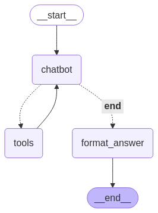
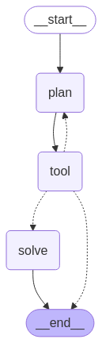
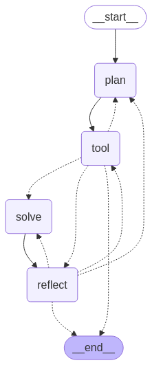

# Experiments

## Choosing of the model
In this experiment, we evaluated three language models: **Gemma**, **Mistral** and **OpenAI**. These models were utilized for tasks involving mathematical reasoning. The primary objective was to compare their performance and precision in order to identify the most suitable model for future experiments involving math-solving agents.

### Model testing and Results

The models were tested on a dataset of 100 random samples from the **GSM8K** test dataset, which consists of mathematical problems and their corresponding solutions. The testing was conducted using a random seed value of 42 to always use the same random sample, and a zero-shot prompting approach was employed. The **Gemma** and **Mistral** models were executed locally and and they didn't show very good results. In contrast, the **OpenAI** model demonstrated exceptionally rapid performance during the testing phase. Here are the obtained results:

| Model   | Precision |
|---------|----------|
| Gemma   | 0.76     |
| Mistral | 0.46     |
| OpenAI  | 0.85     |

### Final decision on the model

We selected the **OpenAI** model for our forthcoming experiments due to its superior performance in zero-shot prompting, achieving a precision of **0.85**. The model provides structured output, obviating the need to utilize our CPU resources for this purpose.

To ensure the suitability of this model for mathematical problem-solving agents, we conducted tests using few-shot prompting, which yielded a precision of **0.89**.

## Agents

#### Key Components for Agents

1. Language Model Setup

    Uses OpenAI's GPT-4 model `gpt-4o-mini-2024-07-18` with temperature = 0 for deterministic outputs

    Configured with two tools: 
    - **SymPy tool** for symbolic math calculations.
    - **LLM tool** for reasoning and text processing.

---

### React Agent

#### Core Architecture
The system implements a stateful agent that combines LLM reasoning with external tools for mathematical problem solving. It uses a graph-based workflow to manage the interaction between these components.

#### Step-by-step Process

1. Problem Input
- User submits a math word problem
- System initializes with HumanMessage containing the problem

2. Reasoning Phase
- LLM analyzes the problem
- Generates either:
    - Direct answer (if task is simple)
    - Series of tool requests (if calculations needed)

3. Tool Execution
- Dispatches to appropriate tool
- Returns results as ToolMessages
- Math operations use SymPy for precision

4. Iterative Refinement
- Loops back to reasoning with tool results
- Continues until solution is complete

5. Final Formatting
- Normalizes output to strict "Answer: 'value' " format
- Ensures consistency for downstream processing

####  Execution Flow

#### Evaluation Metrics

The agent achieved strong performance during validation on the test dataset, attaining a precision score of **0.90**,

Most incorrect responses fell into two categories:
1. Misinterpretation of Problem Statements – The agent occasionally misidentified key relationships or requirements in the task.
2. Calculation Order Errors – In multi-step problems, incorrect sequencing of operations led to wrong final answers.
3. Error in benchmark

---

### ReWoo Agent

#### Core Architecture
The ReWOO agent implements a plan-then-execute paradigm that separates reasoning from tool usage. Unlike iterative approaches like ReAct, it:
- Creates a complete execution plan upfront
- Runs all tool operations without intermediate LLM consultation
- Synthesizes the final answer in one pass

#### Workflow Logic

1. The LLM generates a detailed plan with
- Descriptive steps (e.g., "Calculate expences").
- Tool calls mapped to variables (e.g., #E1 = Calculate[1000 * 0.3]).

2. Tool Execution
- Tools run sequentially without LLM intervention - they are called in the order specified in the plan.

#### Step-by-step Process

1. Problem Input
- User submits a math word problem
- System initializes with HumanMessage containing the problem

2. Planning
- The LLM generates a structured plan with explicit tool calls
- A system prompt instructs the LLM to:
    - Break the problem into discrete steps.
    - Assign each step to a tool.
    - Store outputs in variables.
- Then the pan is parsed into executable steps. 

3. Execution
- Tools compute values (#E1 = 300, #E2 = 1000, etc.). They are executed without LLM oversight

4. Solving
- LLM combines original task, executed plan and format of the answer to generate the final answer.

####  Execution Flow

#### Evaluation Metrics

The agent achieved a precision score of **1.0** on the test sample, demonstrating perfect accuracy in solving mathematical word problems. This indicates the agent's planning and execution workflow successfully solved all 100 test problems correctly. The precision metric was calculated by comparing the agent's numerical answers against the ground truth solutions from the dataset. 

The agent's strong performance suggests its combination of planning, tool usage, and step-by-step execution is effective for mathematical problem-solving tasks.

-----

### Reflection Agent
The main difference between this agent and the previous ones is that it has a reflection loop. It stores the conversation history and uses it to improve its solution.

#### Step-by-step Process

1. Problem Input
- User submits a math word problem
- System initializes with HumanMessage containing the problem

2. Planning phase the same as the ReWoo agent

3. Execution phase the same as the ReWoo agent

4. Solution synthesis phase.

5. Reflection phase.
- Independent LLM acts as "teacher" to:
    - Verify mathematical correctness
    - Check logical consistency
    - Validate output formatting
- Returns either:
    - "END" (if the answer is correct)
    - Specific improvement suggestions

6. Iterative Refinement
- If flaws are found:
    - Returns to planning phase
    - Adjusts strategy based on feedback
    - Re-runs execution
- Continues until solution passes reflection check

####  Execution Flow 

#### Evaluation Metrics

The agent demonstrated near-perfect problem-solving skills, receiving an accuracy rating of **1.0** on test sample. However, the agent provided an incorrect answer for one of the problems.

A single error was observed during benchmarking, which did not reflect the agent’s actual performance. Manual review confirmed the agent’s logic and calculations were correct for all tasks.